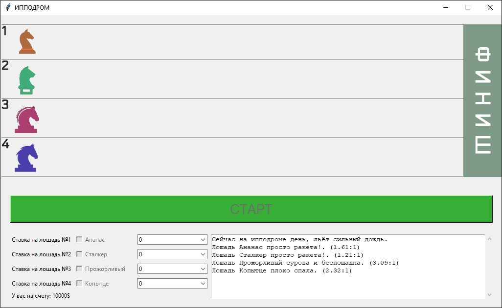

# Hippodrome
 

<b>RU</b> 
Игра-симулятор про ипподром, где вы ставите ставки на лошадей. Во время заезда могут возникнуть разные ситуации, например, лошадь может сбросить жокея или развернуться. В текстовом поле выводится имя и коэффицент на победу.

<b>EN</b> 
A simulator game about a racetrack where you bet on horses. During the race, different situations may arise, for example, a horse may throw off a jockey or turn around. The name and the winning coefficient are displayed in the text field.
